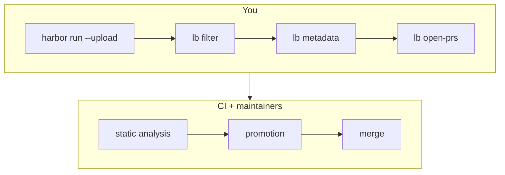

# Submitting to the Leaderboard

This guide walks through turning finished Harbor jobs into ORCA-bench
leaderboard rows: filter your jobs into submissions, fill in display metadata,
open one PR per submission, and follow the review pipeline until your row lands
on the leaderboard.



Your side of the flow is the `lb` CLI (`uv run lb --help`). Run every command
below from this `leaderboard/` directory — the CLI writes and commits
`submissions/` paths relative to it.

**The short version:** `uv run lb submit <job-links...>` does all three steps
(filter → metadata → open-prs) in one go. If
[`display_names.json`](src/leaderboard/display_names.json) already maps your
agent and model — pre-populate it with your display names/orgs if not — it
runs with no prompts at all. The numbered steps below run one command at a
time so you can inspect the files between steps.

## Before you start

- **Run the leaderboard dataset, unmodified.** Your jobs must run the exact
  dataset version pinned in [`core/hub.py`](src/leaderboard/core/hub.py)
  (`DATASET@DATASET_REF`) — the ORCA-bench dataset **as published on the Harbor
  Hub**. The HuggingFace-registry config in
  [`configs/harbor_job_orca_bench.yaml`](../configs/harbor_job_orca_bench.yaml)
  is for local development; its trials carry a different source and are
  filtered out. Use [`job-config.yaml`](../job-config.yaml) at the repo root,
  which pins the hub dataset.
- **Default execution settings.** `timeout_multiplier = 1.0`, no agent or
  verifier timeout overrides, no resource overrides. CI rejects anything else —
  a stretched timeout or extra CPU is what makes a score incomparable.
- **Cover every task.** A submission must include all tasks in the dataset,
  with at least `MIN_TRIALS_PER_TASK` trials each (pinned in
  [`ci/static_analysis.py`](src/leaderboard/ci/static_analysis.py); the expected
  task count is read from the dataset registry, not hardcoded). A trial that
  errored before producing a verdict is **excluded** from the metrics, so it
  does not count toward coverage either — if it was a task's only trial, that
  task is missing and the check fails. Re-run it.
- **The judge needs its key.** ORCA-bench's verifier is an LLM judge
  (`check_prediction.py`). Pass `OPENAI_API_KEY` (and `OPENAI_BASE_URL` if your
  provider needs it) to the verifier with `--ve`. Unlike some benchmarks there
  is nothing to configure: the judge model and reasoning effort are baked into
  the task content, so every submission uses the same judge by construction.
- **Snapshot image.** ORCA-bench tasks need the otel-demo snapshot staged on
  the host. Run through `run_harbor_cached.sh`, which exports
  `SNAPSHOT_CACHE_HOST_DIR`; a plain `harbor run` fails fast without it.
- **Upload your jobs.** Run with `--upload --public` (or upload afterwards) so
  the trials are on the [Harbor hub](https://hub.harborframework.com) — CI reads
  everything from there. Trials must be publicly readable.
- **Tooling:** [`uv`](https://docs.astral.sh/uv/) and an authenticated
  [`gh`](https://cli.github.com/) CLI. If you don't have push access to this
  repo, work from a fork clone — the PR scripts push branches to `origin`.

## 1. Filter your jobs into submission files

Give `lb filter` your hub job links (or bare UUIDs):

```sh
uv run lb filter https://hub.harborframework.com/jobs/<uuid> [more...]
```

It writes **one JSON per unique (agent, agent version, model, reasoning
effort)** into `leaderboard/submissions/`, named `<date>-<model>-<effort>-<agent>.json`.
A job that ran several agent+model pairs produces several files; several jobs
contributing to the same key merge into one file (`source_jobs` lists them
all). Each file records:

- `source_jobs` — the job links CI re-derives every trial from
- `source_filter` — the (agent, agent version, model, reasoning effort) key
  that selects your trials out of those jobs; the model is the full
  `provider/model` id (the dataset is a repo-level constant, not part of the
  key)
- `metadata` — `date` and `reasoning_effort` filled in; display fields left
  `null` for the next step
- `metrics` / `disqualified_trials` / `credited_trials` — left empty; CI and
  maintainers fill these later

## 2. Fill in display metadata

The leaderboard shows human-readable names ("GPT-5.5 [OpenAI]", "Terminus 2
[Harbor]"), mapped from raw agent/model ids by
[`display_names.json`](src/leaderboard/display_names.json). Fill your new files:

```sh
uv run lb metadata $(git ls-files --others --exclude-standard submissions)
```

Known agents/models are filled from the map; for anything new it prompts for a
`display_name` and `display_org` and saves the answers back to
`display_names.json` so they're reused next time. (Non-interactive
environments: pre-fill the `null` stubs instead — the script fails rather than
hangs without a terminal.)

All display fields plus `date` are required — PRs with `null` metadata fail
static analysis.

## 3. Open one PR per submission

```sh
uv run lb open-prs $(git ls-files --others --exclude-standard submissions)
```

For each file this creates a `submission/<name>` branch (the filename minus
`.json`) off `main` containing **only that one file**, pushes it, and opens a
PR whose diff is exactly that submission. PRs are independent and can be
reviewed/merged in any order. (You can also just open PRs by hand — CI
requires exactly one added/changed file under `leaderboard/submissions/`, matching
`leaderboard/submissions/<name>.json`; keep other files out of the PR, promotion carries
only the submission file forward.)

## 4. What to expect after opening a PR

### Static analysis (automatic, on every push)

CI posts a sticky comment on your PR with a pass/fail table:

- valid `source_filter` (matches an agent in the job config) and complete
  metadata
- `timeout_multiplier = 1.0`, no agent/verifier timeout overrides, no resource
  overrides
- correct dataset reference and full task coverage
- per-trial records match the job config and every trial ran the canonical
  task version (anti-tampering)

These run against the job config **the hub recorded with your uploaded run**,
not against any file in this repo.

On green it also shows a **Trial Summary** (error breakdown), a
**Submission Summary** (accuracy ± SE, plus total tokens and cost across
all trials), and a **Breakdown** of the same trials by task group. On red, fix
the problem and push an update to the same file — the checks re-run.

**How accuracy is computed.** ORCA-bench rewards are graded in `[0, 1]`, not
pass/fail, so accuracy is the **mean reward** over the **scored** trials — a
report scoring 0.33 contributes a third of a point, not a full success. `± SE`
uses the within-task standard error when tasks have multiple trials, and the
between-task standard error when every task has exactly one; the comment
footer says which.

A trial that produced no verdict — the run died before the verifier scored it —
is dropped rather than counted as `reward 0`, the same rule the analysis
pipeline uses (`utils.load_trials`, which skips a trial with no
`reward-details.json`). Averaging in a trial that was never judged would
understate the result. The Trial Summary still lists every trial and its error,
and says how many were excluded; a maintainer can override an errored trial via
`credited_trials` / `disqualified_trials`, which wins over the exclusion.

**What the breakdown splits.** Two per-trial metrics — `reward` (the graded
score) and `rca_accuracy` (did the report name the root cause?) — over five
groups: **incident** vs **control** tasks, and the three difficulty tiers
**easy / medium / hard** within the incident tasks. A task is control iff it has
no incident to find; those tasks still carry a difficulty, so the tier rows
cover incident tasks only. `rca_accuracy` has no control row — a control task
has no root cause to name, so the metric is 0 there by construction. All of
these land on the leaderboard as their own columns alongside `accuracy`, which
remains the ranking metric.

### Promotion (automatic, on green)

CI clones your trials into leaderboard-owned copies (so the record can't be
mutated or deleted later), opens a repo-owned **bot PR** from branch
`submission/pr-<N>` carrying the promoted JSON — with the computed metrics
(accuracy plus token/cost totals) and a `metadata.pr` link back to the bot PR
stamped in — and **closes your PR**. This is normal — review and merge
continue on the bot PR, and your PR stays closed. To amend metadata
afterwards, open a new PR into `submission/pr-<N>`; for substantive changes
(different jobs/trials), open a fresh submission PR.

### Review + merge (maintainer)

A maintainer reviews the bot PR and merges it. If a trial turns out to be
scored wrongly, they can hand-edit `disqualified_trials` (forces `reward 0`) or
`credited_trials` (forces `reward 1`) on the bot PR before merging; metrics are
recomputed from those lists at submit time. Token and cost totals always count
every trial that ran — an override changes a trial's reward, not its resource
usage.

When the bot PR is merged, the final row — display metadata + metrics — is
submitted to the leaderboard automatically, and CI comments a link to the new
leaderboard entry on the merged PR.

A bot PR closed **without** merging is cleaned up instead: its branch and the
leaderboard-owned trial clones are deleted. Merged PRs keep their clones —
they are what the leaderboard record points at.
