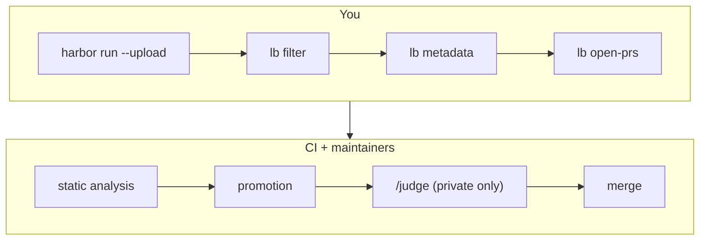

# Submitting to the Leaderboard

This guide walks through turning finished Harbor jobs into ORCA-bench
leaderboard rows: filter your jobs into submissions, fill in display metadata,
open one PR per submission, and follow the review pipeline until your row lands
on the leaderboard.

There are two boards. The **public** leaderboard runs the 755 released tasks
(`orca-bench/orca-bench`), scored in-container by each task's own verifier.
The **private** leaderboard runs the 324 held-out tasks
(`orca-bench/orca-bench-private`), which ship without answers and are scored
out-of-band by a maintainer-run judge. Sections 1–4 cover the public board;
[Submitting to the private leaderboard](#submitting-to-the-private-leaderboard)
covers what changes for the private one.



Your side of the flow is the `lb` CLI (`uv run lb --help`). Run every command
below from this `leaderboard/` directory — the CLI writes and commits
`submissions/` paths relative to it.

**The short version:** `uv run lb submit <job-links...>` does all three steps
(filter → metadata → open-prs) in one go. If
[`display_names.json`](src/leaderboard/display_names.json) already maps your
agent and model — pre-populate it with your display names/orgs if not — it
runs with no prompts at all. The numbered steps below run one command at a
time so you can inspect the files between steps.

## Before you start

- **Run the leaderboard dataset, unmodified.** Your jobs must run the exact
  dataset version pinned in [`core/hub.py`](src/leaderboard/core/hub.py)
  (`PUBLIC.dataset@PUBLIC.ref`, or the `PRIVATE` pair for the private board) —
  the ORCA-bench dataset **as published on the Harbor Hub**. The HuggingFace-registry config in
  [`configs/harbor_job_orca_bench.yaml`](../configs/harbor_job_orca_bench.yaml)
  is for local development; its trials carry a different source and are
  filtered out. Use [`job-config.yaml`](../job-config.yaml) at the repo root,
  which pins the hub dataset.
- **Default execution settings.** `timeout_multiplier = 1.0`, no agent or
  verifier timeout overrides, no resource overrides. CI rejects anything else —
  a stretched timeout or extra CPU is what makes a score incomparable.
- **Cover every task.** A submission must include all tasks in the dataset,
  with at least `MIN_TRIALS_PER_TASK` trials each (pinned in
  [`ci/static_analysis.py`](src/leaderboard/ci/static_analysis.py); the expected
  task count is read from the dataset registry, not hardcoded). A trial that
  errored before producing a verdict is **excluded** from the metrics, so it
  does not count toward coverage either — if it was a task's only trial, that
  task is missing and the check fails. Re-run it.
- **The judge needs its key.** ORCA-bench's verifier is an LLM judge
  (`check_prediction.py`). Pass `OPENAI_API_KEY` (and `OPENAI_BASE_URL` if your
  provider needs it) to the verifier with `--ve`. Unlike some benchmarks there
  is nothing to configure: the judge model and reasoning effort are baked into
  the task content, so every submission uses the same judge by construction.
- **Snapshot image.** ORCA-bench tasks need the otel-demo snapshot staged on
  the host. Run through `run_harbor_cached.sh`, which exports
  `SNAPSHOT_CACHE_HOST_DIR`; a plain `harbor run` fails fast without it.
- **Upload your jobs.** Run with `--upload --public` (or upload afterwards) so
  the trials are on the [Harbor hub](https://hub.harborframework.com) — CI reads
  everything from there. Trials must be publicly readable.
- **Tooling:** [`uv`](https://docs.astral.sh/uv/) and an authenticated
  [`gh`](https://cli.github.com/) CLI. If you don't have push access to this
  repo, work from a fork clone — the PR scripts push branches to `origin`.

## 1. Filter your jobs into submission files

Give `lb filter` your hub job links (or bare UUIDs):

```sh
uv run lb filter https://hub.harborframework.com/jobs/<uuid> [more...]
```

It writes **one JSON per unique (agent, agent version, model, reasoning
effort)** into `leaderboard/submissions/`, named `<date>-<model>-<effort>-<agent>.json`.
A job that ran several agent+model pairs produces several files; several jobs
contributing to the same key merge into one file (`source_jobs` lists them
all). Each file records:

- `source_jobs` — the job links CI re-derives every trial from
- `source_filter` — the (agent, agent version, model, reasoning effort) key
  that selects your trials out of those jobs; the model is the full
  `provider/model` id (the dataset is a repo-level constant, not part of the
  key)
- `metadata` — `date` and `reasoning_effort` filled in; display fields left
  `null` for the next step
- `metrics` / `disqualified_trials` / `credited_trials` — left empty; CI and
  maintainers fill these later

## 2. Fill in display metadata

The leaderboard shows human-readable names ("GPT-5.5 [OpenAI]", "Terminus 2
[Harbor]"), mapped from raw agent/model ids by
[`display_names.json`](src/leaderboard/display_names.json). Fill your new files:

```sh
uv run lb metadata $(git ls-files --others --exclude-standard submissions)
```

Known agents/models are filled from the map; for anything new it prompts for a
`display_name` and `display_org` and saves the answers back to
`display_names.json` so they're reused next time. (Non-interactive
environments: pre-fill the `null` stubs instead — the script fails rather than
hangs without a terminal.)

All display fields plus `date` are required — PRs with `null` metadata fail
static analysis.

## 3. Open one PR per submission

```sh
uv run lb open-prs $(git ls-files --others --exclude-standard submissions)
```

For each file this creates a `submission/<name>` branch (the filename minus
`.json`) off `main` containing **only that one file**, pushes it, and opens a
PR whose diff is exactly that submission. PRs are independent and can be
reviewed/merged in any order. (You can also just open PRs by hand — CI
requires exactly one added/changed file under `leaderboard/submissions/`, matching
`leaderboard/submissions/<name>.json`; keep other files out of the PR, promotion carries
only the submission file forward.)

## 4. What to expect after opening a PR

### Static analysis (automatic, on every push)

CI posts a sticky comment on your PR with a pass/fail table:

- valid `source_filter` (matches an agent in the job config) and complete
  metadata
- `timeout_multiplier = 1.0`, no agent/verifier timeout overrides, no resource
  overrides
- correct dataset reference and full task coverage
- per-trial records match the job config and every trial ran the canonical
  task version (anti-tampering)

These run against the job config **the hub recorded with your uploaded run**,
not against any file in this repo.

On green it also shows a **Trial Summary** (error breakdown) and a
**Submission Summary** carrying the three published metrics plus total tokens
and cost. On red, fix the problem and push an update to the same file — the
checks re-run.

**What the leaderboard publishes.** Three metrics, all over **incident** tasks
only — the panels of `plot_rca_and_hallucination.py`:

| Column | Metric |
| --- | --- |
| **RCA Accuracy (Medium)** ↑ | did the report name the root cause, on the broad-feature-area tier |
| **RCA Accuracy (Hard)** ↑ | the same, on the flag-agnostic tier (no hint which flag failed) |
| **Hallucination Rate** ↓ | did the report name a root cause that matches none of the plausible ones |

Each cell is `mean ± one standard error`, as percentages. The two RCA columns
are higher-is-better; Hallucination Rate is lower-is-better. Rows are ranked by
RCA Accuracy (Medium), descending.

Everything is restricted to incident tasks: a control task has no root cause, so
`rca_accuracy` is 0 there by construction and `hallucinate_any` is not emitted
at all. Control tasks still carry a difficulty, which is why the tier metrics
intersect with "not control" rather than partitioning on difficulty alone. The
easy tier is deliberately not published — it looks deceptively good and pulls
attention from the realistic setting.

**Unscored trials are excluded.** A trial that produced no verdict — the run
died before the verifier scored it — is dropped rather than counted as 0, the
same rule the analysis pipeline uses (`utils.load_trials`, which skips a trial
with no `reward-details.json`). Averaging in a trial that was never judged would
understate the result. The Trial Summary lists every trial and its error and
says how many were excluded, and `n` beside each metric is the trial count that
metric was actually computed over.

Note the `credited_trials` / `disqualified_trials` overrides force a trial's
*reward*, which is no longer published — they no longer move any leaderboard
number. They still affect the coverage check, since an override keeps an
otherwise-unscored trial in the task count.

### Promotion (automatic, on green)

CI clones your trials into leaderboard-owned copies (so the record can't be
mutated or deleted later), opens a repo-owned **bot PR** from branch
`submission/pr-<N>` carrying the promoted JSON — with the computed metrics
(accuracy plus token/cost totals) and a `metadata.pr` link back to the bot PR
stamped in — and **closes your PR**. This is normal — review and merge
continue on the bot PR, and your PR stays closed. To amend metadata
afterwards, open a new PR into `submission/pr-<N>`; for substantive changes
(different jobs/trials), open a fresh submission PR.

### Review + merge (maintainer)

A maintainer reviews the bot PR and merges it. If a trial turns out to be
scored wrongly, they can hand-edit `disqualified_trials` (forces `reward 0`) or
`credited_trials` (forces `reward 1`) on the bot PR before merging; metrics are
recomputed from those lists at submit time. Token and cost totals always count
every trial that ran — an override changes a trial's reward, not its resource
usage.

When the bot PR is merged, the final row — display metadata + metrics — is
submitted to the leaderboard automatically, and CI comments a link to the new
leaderboard entry on the merged PR.

A bot PR closed **without** merging is cleaned up instead: its branch and the
leaderboard-owned trial clones are deleted. Merged PRs keep their clones —
they are what the leaderboard record points at.

## Submitting to the private leaderboard

The public split's answers travel with the tasks: `harbor run` puts every
`tests/expected.json` and `tests/rubrics/` on the machine that runs them, so
anyone who has run the public board holds the root cause for all 755 tasks.
The private board exists so there is also a number that cannot have been
trained or tuned against. Its 324 tasks (31 incidents; 108 easy, 117 medium,
99 hard) are disjoint from the public set **at the incident level** — no
incident appears on both sides — and are published as
`orca-bench/orca-bench-private` with everything that names or dates the root
cause stripped out: no `tests/expected.json`, `tests/rubrics/`,
`tests/check_prediction.py` or `solution/`, and a `task.toml` `[metadata]`
reduced to `category`, `tags`, `user_facing_issue`, `current`,
`reported_styled` and `difficulty`.

The flow is the same as above with three differences: which dataset you run,
what a finished trial looks like, and one extra step in the pipeline — a
maintainer scores your trials with the LLM judge before the row is merged.

### Run the private split

Everything under [Before you start](#before-you-start) still applies — default
execution settings, full coverage (all 324 tasks, `MIN_TRIALS_PER_TASK` each),
the staged snapshot image, public upload. Pass the private dataset on the
command line; `-d` replaces the `datasets:` entry in `job-config.yaml`, so the
rest of the config (agents, `timeout_multiplier`, concurrency) carries over
unchanged:

```bash
SNAPSHOT_IMAGE=orcabench/sre-otel-snapshot:data-0418-harbor-template-v2 \
    ./run_harbor_cached.sh -c job-config.yaml \
      -d orca-bench/orca-bench-private \
      -a <agent> -m <provider/model> \
      --upload --public
```

Two things differ from a public run:

- **No verifier key is needed.** The private tasks have no in-container judge
  to call, so `--ve OPENAI_API_KEY` does nothing here. Your agent's own
  provider credentials are still required.
- **Every trial finishes unscored — that is expected.** The private tasks'
  `tests/test.sh` copies the agent's `report.md` into the verifier output and
  writes an empty rewards map (`{}`), so the hub shows no reward for any trial.
  Do not treat that as a failed run or try to score it yourself; the report is
  the only output the judge needs, and the rubric it is scored against is not
  public.

### Open the PR

Exactly as for the public board, from `leaderboard/`:

```sh
uv run lb submit https://hub.harborframework.com/jobs/<uuid> [more...]
```

One submission file and one PR per (agent, agent version, model, reasoning
effort), as before, except that the file is named `…-private.json` and carries
`"board": "private"` — that field is what routes it to the private board. The
board is part of the filter key, so a job that ran both datasets yields two
files; do not hand-merge them, they are different boards.

### What to expect after opening a PR

**Static analysis and promotion** run as for the public board: the same
dataset-ref, execution-settings and per-trial digest checks, with coverage
measured against the 324 private tasks. Because private trials carry no
verdict by construction, the "unscored trials are excluded" rule does not
apply to them — coverage counts every trial that reached its verifier (a
trial that errored during setup still does not; one whose agent timed out
does, as on the public board). The comment's **Private-split scoring** check
reads "pending `/judge`" and no metrics are shown yet. On green, CI clones
your trials into leaderboard-owned copies and opens the bot PR, as above.

**Judging** is the extra step. A maintainer comments `/judge` on the bot PR.
That runs `run_llm_judge.py` over every trial of your submission, scoring each
agent report against its task's held-back ground truth with the **same judge
model and reasoning effort the public split's in-container verifier uses**, so
private and public scores are comparable. It is a maintainer action because
the judge holds the answers and the API key; there is nothing for you to run.
When it finishes:

- per-trial scores are committed to `leaderboard/scores/<submission>.json` on
  the bot branch, keyed by trial id. Each record carries only what the public
  verifier would have written to `reward.json` — the reward plus
  `rca_accuracy` / `hallucinate_any` where defined — and never the flag, the
  rubric or the judge's reasoning, so publishing it leaks nothing about the
  held-out answers;
- the three leaderboard metrics are computed from those scores and written
  into the submission on the bot branch — `/judge` refuses to write them
  unless every trial has a verdict;
- a sticky **LLM Judge** comment summarizes the run: trial counts by judge
  mode, errored trials, the incident-only RCA accuracy and hallucination
  rate, and the leaderboard metrics as written.

A trial the judge could not score (`llm_judge_error`, `hub_fetch_error`)
shows up in that summary as errored; the maintainer re-runs `/judge` before
merging rather than merge a partially judged submission.

**Review + merge** then proceeds as for the public board, with the metrics
already computed from the committed scores instead of the trials' own rewards.
The published columns are the same three — RCA Accuracy (Medium), RCA Accuracy
(Hard), Hallucination Rate — over incident tasks only, ranked by RCA Accuracy
(Medium), and the row lands on the `orca-bench-private` leaderboard on the hub
rather than the public one. Merging a private submission that was never judged,
or judged only partially, posts no row: the merge step re-checks the scores
file against the submission's trials first.
